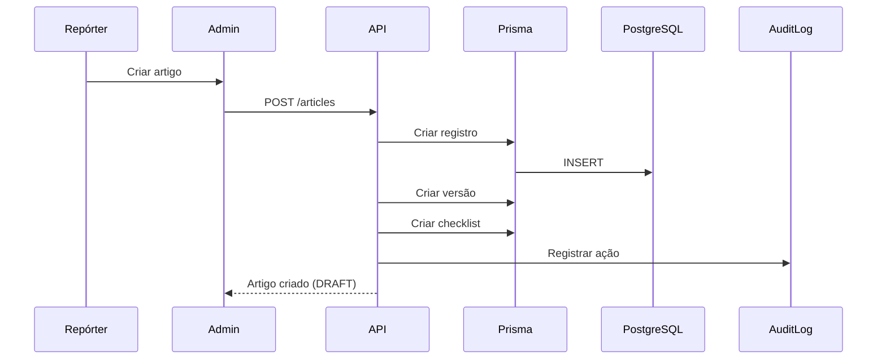
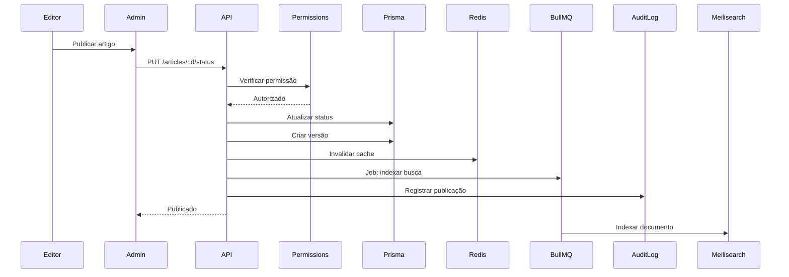
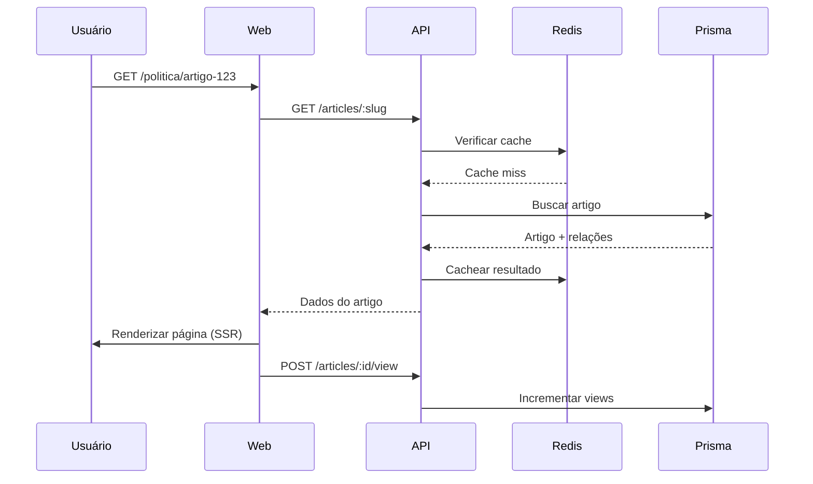

# 🏗️ Arquitetura Técnica

## Visão Geral

O CMS Portal de Notícias é construído com arquitetura de **monorepo** usando **pnpm workspaces** e **Turbo** para orquestração de builds.

## Diagrama de Arquitetura

```
┌─────────────────────────────────────────────────────────────┐
│                        Frontend Layer                        │
├──────────────────────┬─────────────────────┬────────────────┤
│  Web (Next.js)       │  Admin (Next.js)    │  Mobile (TBD)  │
│  dopovo.com.br       │  localhost:3001     │                │
│  diario.dopovo.com.br│                     │                │
└──────────────────────┴─────────────────────┴────────────────┘
                              ↓
┌─────────────────────────────────────────────────────────────┐
│                      API Layer (NestJS)                      │
├──────────────────────────────────────────────────────────────┤
│  ● Auth & RBAC     ● Articles       ● Categories            │
│  ● Media           ● Home Builder   ● Comments              │
│  ● Ads             ● Search         ● Analytics             │
└─────────────────────────────────────────────────────────────┘
                              ↓
┌─────────────────────────────────────────────────────────────┐
│                    Business Logic Layer                      │
├──────────────────────────────────────────────────────────────┤
│  ● Workflow Editorial    ● Versionamento                     │
│  ● Lock Otimista         ● Auditoria                         │
│  ● Permissions Check     ● Event Handling                    │
└─────────────────────────────────────────────────────────────┘
                              ↓
┌─────────────────────────────────────────────────────────────┐
│                      Data Layer (Prisma)                     │
├──────────────────────────────────────────────────────────────┤
│  ● ORM                   ● Migrations                        │
│  ● Type Safety           ● Query Builder                     │
└─────────────────────────────────────────────────────────────┘
                              ↓
┌─────────────────────────────────────────────────────────────┐
│                    Infrastructure Layer                      │
├───────────┬──────────┬──────────────┬──────────┬───────────┤
│ PostgreSQL│  Redis   │ Meilisearch  │  MinIO   │  BullMQ   │
│  (Data)   │ (Cache)  │   (Search)   │  (S3)    │  (Jobs)   │
└───────────┴──────────┴──────────────┴──────────┴───────────┘
```

## Camadas da Aplicação

### 1. Frontend Layer

#### Web App (Next.js 14+)
- **Responsabilidade**: Portal público
- **Tecnologias**: Next.js, React, Tailwind, TipTap
- **Features**:
  - SSR/ISR para performance e SEO
  - Páginas dinâmicas por site
  - Sistema de busca
  - Comentários interativos
  - Consumo de home builder

#### Admin App (Next.js 14+)
- **Responsabilidade**: CMS/Back-office
- **Tecnologias**: Next.js, React, Tailwind, shadcn/ui
- **Features**:
  - Editor de artigos (TipTap)
  - Home page builder (drag-and-drop)
  - Gestão de mídia (DAM)
  - Dashboards e analytics
  - Sistema de permissões

### 2. API Layer (NestJS)

#### Estrutura Modular

```typescript
AppModule
├── AuthModule         # JWT, RBAC, Sessions
├── ArticlesModule     # CRUD + Workflow
├── CategoriesModule   # Taxonomia
├── TagsModule         # Tags
├── MediaModule        # Upload e DAM
├── HomeModule         # Page Builder
├── CommentsModule     # Comments + Moderation
├── AdsModule          # Advertising
└── UsersModule        # User Management
```

#### Responsabilidades
- **Autenticação**: JWT + Refresh Tokens
- **Autorização**: RBAC granular
- **Validação**: DTOs com class-validator
- **Transformação**: Serialização de dados
- **Documentação**: OpenAPI/Swagger

#### Guards e Interceptors

```typescript
// Auth Guard
@UseGuards(JwtAuthGuard)

// Permissions Guard
@UseGuards(JwtAuthGuard, PermissionsGuard)
@Permissions({ resource: 'articles', action: 'create' })

// Rate Limiting
@UseGuards(ThrottlerGuard)
```

### 3. Business Logic Layer

#### Workflow Editorial

**Estados e Transições**:
```
DRAFT → IN_REVIEW → APPROVED → SCHEDULED → PUBLISHED
                                            ↓
                                        ARCHIVED
```

**Regras**:
- Repórter cria artigo (DRAFT)
- Editor revisa (IN_REVIEW)
- Editor-Chefe aprova (APPROVED)
- Sistema publica (PUBLISHED)
- Auditoria em cada transição

#### Versionamento

Cada alteração gera uma nova versão:
```typescript
{
  version: 1,
  title: "Título original",
  content: "Conteúdo original",
  changes: {},
  createdBy: "userId",
  createdAt: "2024-01-15T10:00:00Z"
}
```

**Rollback**: Reverter para qualquer versão anterior.

#### Lock Otimista

Previne conflitos de edição:
```typescript
{
  lockedBy: "userId",
  lockedAt: "2024-01-15T10:00:00Z",
  lockDuration: 300000 // 5 minutos
}
```

Se outro usuário tentar editar:
- Se lock válido: erro
- Se lock expirado: assume o lock

### 4. Data Layer (Prisma)

#### Schema Design

**Princípios**:
- Normalização adequada
- Índices estratégicos
- Foreign keys com cascade
- Soft deletes onde apropriado
- Timestamps automáticos

**Principais Relações**:
```prisma
Site 1───N Article
Article N───1 Category
Article N───N Tag (via ArticleTag)
Article 1───N ArticleVersion
Article 1───1 EditorialChecklist
Article N───N MediaAsset (via ArticleMedia)
Article 1───N Comment
```

#### Estratégias de Query

**Eager Loading**:
```typescript
include: {
  author: true,
  category: true,
  tags: { include: { tag: true } }
}
```

**Paginação**:
```typescript
{
  skip: (page - 1) * limit,
  take: limit
}
```

**Filtering**:
```typescript
where: {
  status: 'PUBLISHED',
  publishedAt: { lte: new Date() },
  category: { slug: 'politica' }
}
```

### 5. Infrastructure Layer

#### PostgreSQL
- **Propósito**: Banco principal
- **Configuração**: 
  - Connection pooling
  - Prepared statements
  - Índices otimizados

#### Redis
- **Propósito**: Cache e sessões
- **Uso**:
  - Cache de queries frequentes
  - Sessões de usuários (JWT)
  - Rate limiting
  - Fila de jobs (BullMQ)

**Estratégia de Cache**:
```typescript
// Cache por 1 hora
const cacheKey = `article:${id}`;
const cached = await redis.get(cacheKey);

if (cached) return JSON.parse(cached);

const article = await prisma.article.findUnique({...});
await redis.set(cacheKey, JSON.stringify(article), 3600);
```

#### Meilisearch
- **Propósito**: Busca full-text
- **Indexação**:
  - Título
  - Conteúdo
  - Excerpt
  - Autor
  - Tags

**Sync Strategy**:
```typescript
// Ao publicar artigo
await meilisearch.index('articles').addDocuments([{
  id: article.id,
  title: article.title,
  content: stripHtml(article.content),
  // ...
}]);
```

#### MinIO (S3)
- **Propósito**: Storage de mídia
- **Estrutura**:
  ```
  cms-media/
  ├── images/
  │   ├── original/
  │   └── thumbnails/
  ├── videos/
  ├── audios/
  └── documents/
  ```

**Upload Flow**:
```typescript
1. Frontend solicita presigned URL
2. API gera URL assinada (válida por 10min)
3. Frontend faz upload direto para MinIO
4. Frontend notifica API do sucesso
5. API cria registro no banco
```

#### BullMQ
- **Propósito**: Processamento assíncrono
- **Jobs**:
  - Processamento de imagens
  - Envio de newsletters
  - Indexação de busca
  - Geração de sitemaps
  - Limpeza de cache

## Fluxos Principais

### Criação de Artigo



### Publicação de Artigo



### Visualização no Portal



## Segurança

### Autenticação

**JWT Flow**:
```
1. Login → Valida credenciais
2. Gera access token (15min)
3. Gera refresh token (7d)
4. Armazena sessão no Redis
5. Retorna tokens ao cliente
```

**Token Structure**:
```json
{
  "sub": "userId",
  "email": "user@example.com",
  "username": "username",
  "iat": 1234567890,
  "exp": 1234568790
}
```

### Autorização (RBAC)

**Hierarquia**:
```
SuperAdmin (100)
└── Admin (90)
    └── Editor-Chefe (80)
        └── Editor (70)
            └── Repórter (60)
```

**Permission Check**:
```typescript
if (user.role.level >= 80) {
  // Editor-Chefe e acima
}

if (hasPermission('articles', 'publish')) {
  // Tem permissão específica
}
```

### Validação de Input

**DTOs com class-validator**:
```typescript
class CreateArticleDto {
  @IsString()
  @MinLength(10)
  @MaxLength(200)
  title: string;

  @IsString()
  @Matches(/^[a-z0-9-]+$/)
  slug: string;

  @IsUUID()
  categoryId: string;
}
```

### Rate Limiting

```typescript
@Throttle(100, 60) // 100 req/min
```

### Sanitização

- HTML: Sanitizar conteúdo do editor
- SQL: Prisma previne injection
- XSS: Helmet + CSP headers

## Performance

### Estratégias de Cache

**Níveis**:
1. **CDN**: Assets estáticos
2. **Redis**: Queries frequentes
3. **ISR (Next.js)**: Páginas pré-renderizadas
4. **Browser**: Service Workers

**TTL Strategy**:
```typescript
const ttl = {
  article: 3600,        // 1h
  homepage: 300,        // 5min
  category: 1800,       // 30min
  search: 600,          // 10min
  userSession: 86400    // 24h
}
```

### Otimização de Queries

**Select Specific Fields**:
```typescript
select: {
  id: true,
  title: true,
  slug: true,
  // Não busca content (grande)
}
```

**Pagination**:
```typescript
// Cursor-based para grandes datasets
cursor: { id: lastId },
take: 20
```

### Índices Estratégicos

```prisma
@@index([siteId, slug])
@@index([status, publishedAt])
@@index([categoryId, publishedAt])
```

## Escalabilidade

### Horizontal Scaling

**API**: Stateless, pode rodar N instâncias
```
Load Balancer
├── API Instance 1
├── API Instance 2
└── API Instance 3
```

**Redis**: Cluster mode
**PostgreSQL**: Read replicas

### Vertical Scaling

- Aumentar recursos do PostgreSQL
- Aumentar pool de conexões
- Aumentar workers do BullMQ

## Monitoramento

### Logs Estruturados

```typescript
logger.info('Article published', {
  articleId,
  userId,
  timestamp: new Date(),
  duration: 123
});
```

### Métricas

- Tempo de resposta da API
- Taxa de erro
- Uso de cache (hit/miss)
- Fila de jobs
- Throughput

### Health Checks

```typescript
GET /health
{
  status: 'ok',
  database: 'connected',
  redis: 'connected',
  meilisearch: 'connected'
}
```

## Deploy

### Ambiente de Produção

**Requisitos**:
- Node.js 18+
- PostgreSQL 14+
- Redis 7+
- 2GB RAM mínimo
- 20GB disco

**Variáveis Críticas**:
```bash
NODE_ENV=production
DATABASE_URL=
REDIS_URL=
JWT_SECRET=
NEXTAUTH_SECRET=
```

### CI/CD

```yaml
# .github/workflows/ci.yml
1. Install dependencies
2. Lint
3. Type check
4. Run tests
5. Build
6. Deploy
```

## Próximas Melhorias

- [ ] Implement Meilisearch integration
- [ ] Add e2e tests (Playwright)
- [ ] Implement frontend (Admin + Web)
- [ ] Add GraphQL layer (opcional)
- [ ] Implement WebSockets (live updates)
- [ ] Add i18n support
- [ ] Implement paywall system
- [ ] Add A/B testing framework
